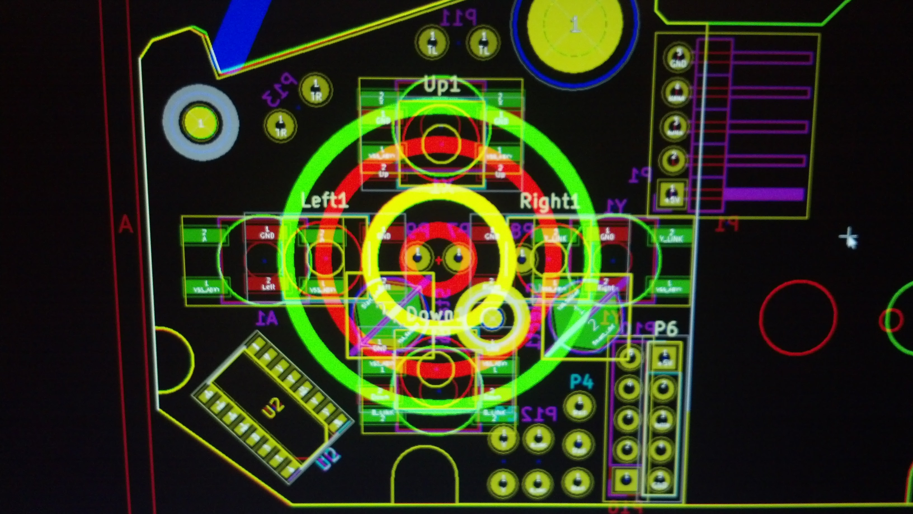
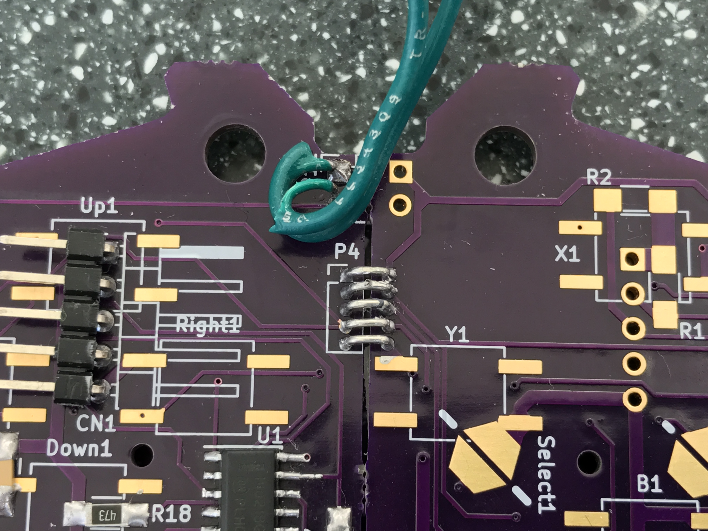

```
     ______     ___   ___   _______     _______   _______
    / ___. \   /  /  /  /  /  ___  \   /  ____/  /  ___  \
   / /   / /  /  /  /  /  /  /  /  /  /  /      /  /  /  /
   | \  /_/  /  /  /  /  /  /  /  /  /  /___   /  /__/  /
  _ \ \     /  /  /  /  /  /__/  /  /  ____/  /      __/
 / / \ \   /  /  /  /  /  _____,'  /  /      /  ___.  \
/ /__/ /  /  /__/  /  /  /        /  /___   /  /   /  /
\_____/   \_______/  /__/        /______/  /__/   /__/

≡≡≡≡≡≡≡≡≡≡≡≡≡≡≡≡≡≡≡≡≡≡≡≡≡≡≡≡≡≡≡≡≡≡≡≡≡≡≡≡≡≡≡≡≡≡≡≡≡≡≡≡≡≡≡≡
#    C  L  I  C  K  E  T  Y  -  C  L  A  C  K  E  R    #
≡≡≡≡≡≡≡≡≡≡≡≡≡≡≡≡≡≡≡≡≡≡≡≡≡≡≡≡≡≡≡≡≡≡≡≡≡≡≡≡≡≡≡≡≡≡≡≡≡≡≡≡≡≡≡≡
    ______    ___     ____    ____     ______    _   __
 __/ ____/___/   |___/  _/_  / __ \   / ____/   / | / /
  / / __  __/ /| |___/ /____/ / / /__/ __/__   /  |/ /
 / /_/ /   / ___ | _/ /  __/ /_/ /__/ /_______/ /|  /__
 \____/   /_/  |_|/___/   /_____/  /_____/   /_/ |_/


                            /\
  /\-----------------------/__\---------------------/\
 /--\                    CONTENTS                  /--\
/`\/`\--------------------------------------------/`\/`\
¯¯¯¯¯¯                                            ¯¯¯¯¯¯
```
- [Introduction](#introduction)
- [Thaumaturgical Design](#thaumaturgical-design)
- [Reagents](#reagents)
- [Crafting Notes](#crafting-notes)
- [Epilogue](#epilogue)


## Introduction

Hail adventurer! I see my little trinket has caught your attention.
If you're interested, I'll tell you all about it. Just pull up a stool and order
your favorite libation. I can vouch for the quality of the ale but be warned:
the bartender is an incurable gossip!

What is it, you ask? Why, it's a SNES controller. Ha! It's barely recognizable
compared to your usual, mundane variety. But, I'll get to that...

Let me tell you why it's useful -- I used to have terrible problems with the
standard SNES controller. After years of adventuring I've developed what the
seven sages call sore-thumb-itosis. Even Morgia root can't treat it once the
disease reaches it's advances stage.  
Well, this sore-thumb-itosis was preventing me from making progress in my
adventures. I couldn't even make it to base camp most of the time.  
But, fortunately, I met a fellow adventurer one evening in an inn much like this
one. He told me that he used to be a great adventurer (until he took an arrow to
the knee), and told me of others he'd met who had a similar problem.
It turns out the issue is fundamental to the design of the stock controller --
the rubber membranes make only intermittent contact and lack any sort of tactile
feedback. This increases fatigue and leads to sore-thumb-itosis.

So I traveled to the far-away court of OSH Park where they produce bespoke
magical artifacts. There I consulted with their renowned thaumaturgists and
artificers and commissioned this bauble -- it employs tactile switch technology
to resolve the deficiencies of the standard controller.  
The artisans that crafted these tactile switches assure me that I could ascend
even to the heights of Mt. Ordeals and still have energy enough to take on an
ancient Balrog or the evil sorcerer Thanatos.  
(I'm not saying I believe any of that, but those gnomes sure have some pretty
good marketing.)


## Thaumaturgical Design

Well, I could go on about this all evening (and probably will if you let me!)
But I've already gotten ahead of myself. We should begin at the beginning --
with the design of the original SNES controller.
The design is fairly basic; a classic shift register. 60 times each second, the
state of the buttons are latched and shifted out, back to the SNES CPU.
The communication protocol is clearly based on a 4021 asynchronous shift
register; the latch signal is not lined up with a clock edge.

Nintendo has gone through a couple of revisions.
Originally, they had 2 8-bit shift registers daisy-chained together.

Latterly, they moved to a simpler layout with a single 16-bit shift register.


The board is a single layer design, but makes use of a separate carbon-film
layer for the button pads and a few jumper tracks.  
There are some signs that they have created a custom shift register rather than
using a standard 4000-series component. The 8-bit shift registers have a
different pinout than the standard 4021. Also, tn both cases above, we can see
that they have omitted a number of important pull-up resistors, choosing to
instead integrate these into the IC, itself.

This was a little concerning, so I went to the trouble of mocking up a 4021
circuit on a breadboard.

It worked properly once the missing pull-ups were added.

My goal in this project was to reuse most of the existing controller.
This meant fitting into the mechanical envelope of the controller housing and
selecting switches that had the proper height to be actuated by the existing
plastic buttons. Another goal was to use all 3 copies of the board received from
OSH Park as a different piece of the overall layout.
[See below](#why-use-osh-park-for-pcb-manufacture) for more details.

The mechanical layout was perhaps the most difficult part with more than half of
the time spent simply rearranging components.

To create the board outline, I scanned in the controller and traced a one-to-one
DXF from the outline. Along with this outline, I also included drill hole
locations and divided the overall board into thirds. I then mirrored this and
created the PCB routing outline from the intersection of the mirrored and
unmirrored copies.


The plastic shell of the controller has several features molded into it that
provide support for the PCB. I wanted to make sure that I didn't put any
components in a position where they would foul against these, so I added several
annotations to some nonfunctional layers in order to mark the keep-out regions.


---
I see you still have questions.  
#### Why not attach switches to the existing controller PCB?
Alas, this would be somewhat impractical. The existing switch contacts are
covered with a carbon film that is difficult to scrape off and many of the
traces are quite thin so that soldering to them would not provide adequately
mechanical anchoring.
However, this was the route chosen for the left and right trigger switches.

#### Why not create new PCBs for the trigger switches?
This PCB is modeled, but OSH Park doesn't support V-scoring so it would have to
be submitted as a separate design.

#### Why use OSH Park for PCB manufacture?
OSH Park is reasonably cheap and fast. Also, their pricing includes 3 copies of
the design and 2 layers, top and bottom. A shrewd buyer can use this to their
advantage!
By mirroring the board layout both sides can be used, one as the left half and
one as the right half, with the 3rd copy as a spare.
Furthermore, the design could be split into thirds with some pads and traces
serving double duty. The layout is a little more effort, but the manufacturing
cost is reduced by about 50%.

#### How do you test such a complicated design?
It mostly depends on getting things right in the schematic, then the layout
tool will do most of the work for you. When using pads and tracks for multiple
purposes they have to be shown that way in the schematic. Sometimes this
involves extra care to separate power and ground. In other cases it just means
creating a more descriptive label for the net to avoid confusion.
Still, it is easy to get messed up when going through board-to-board jumper
connections or when using two legs of a switch to jump over some other tracks.
To check for this, I made a simple cardboard mockup and highlighted the traces
as I reviewed the path for each signal in the layout.


#### What about those capacitors?
The value was not chosen very scientifically. A review of typical application
circuits indicated a value of 0.1 or 0.01 µF. This is a fairly low speed
application, so the value is probably not critical and I just chose 0.1 µF
arbitrarily.
Those who are concerned with it might follow the methodology in
[this Youtube video](https://www.youtube.com/watch?v=9EaTdc2mr34)
from Alan Wolke (w2aew).


## Reagents

So, you're thinking you might build one for yourself, aye?
It can be done by any experienced thaumaturgist and the fine folks of OSH Park
will be happy to oblige by replicating the design.

So what about the remaining reagents?
None of them are particularly uncommon, so you won't need to fight your way to
the top of Darm Tower to get what you need. Just seek out the nearest outfitter,
guild shop, or magical supply.
I recommend The Sharper Mage in Lycaeum or, failing that, DigiKey.

Here's a list of what you'll need:

### Core Components
* [2x] 4021 8-bit asynchronous shift register in SOIC-16 package
* [2x] ceramic capacitor in 1206 SMD package
  * Exact value is not particularly important
  * Recommend 0.01 µF - 10 µF
* [14x] pull-up resistors in 1206 SMD package
  * Exact value is not particularly important
  * Recommend 10 kΩ - 100 kΩ
* [4x] D-Pad switches (3.8 mm actuator height, Gullwing SMD package)
  * Tactile pushbutton, SPST-NO
  * Recommend comparing exact dimensions to the [KSC datasheet](doc/README.md)
* [4x] ABXY switches (4.3 mm actuator height, Gullwing SMD package)
  * Tactile pushbutton, SPST-NO
  * Recommend comparing exact dimensions to the [KSC datasheet](doc/README.md)
* [10x] Wire Links for Board-to-Board Wiring
  * 0.1 in. (2.54mm) spacing

### Optional Components
* [2x] L/R Trigger switches (7.7 mm actuator height, Gullwing SMD package)
  * Optional, not included in OSH Park-optimized design
  * Tactile pushbutton, SPST-NO
  * Recommend comparing exact dimensions to the [KSC datasheet](doc/README.md)
* [2x] 2-pin headers for trigger boards, 0.1 in. (2.54 mm) spacing
* [2x] 2-pin housing for trigger board wires, 0.1 in. (2.54 mm) spacing
* [1x] 5-pin header for CN1, 0.1 in. (2.54 mm) spacing
* [1x] 5-pin housing for CN1 cable, 0.1 in. (2.54 mm) spacing
* [9x] 0.1 in. (2.54 mm) wire crimps


If you're looking for specific recommendations or need help with DigiKey's
telepathic ordering system, try these mantras:

### Links for Core Components
* [2x] [ON Semi mc14021b](https://www.digikey.com/short/3wn7b8)
* [2x] [0.1 µF 1206 SMD ceramic capacitor](https://www.digikey.com/short/3wn7bm)
* [14x] [47 kΩ 1206 SMD resistor](https://www.digikey.com/short/3wn75j)
* [4x] D-Pad switch
  * No good recommendation yet
  * Pads are set up for [C&K KSC201GLFS](https://www.digikey.com/short/3wn7bn).
    However, this switch does not have a tall enough actuator and has too tall
    of a switch body.
  * The [Bourns 7914H](https://www.digikey.com/short/3nt825) works acceptably
    but doesn't fit the pads and doesn't have a great feel, either.
  * [This search](https://www.digikey.com/short/3nt8n5) may be helpful.
* [4x] [C&K KSC701GLFS](https://www.digikey.com/short/3wn7b0)

### Links for Optional Components
* [2x] [C&K KSC621GLFS](https://www.digikey.com/short/3wn7b1)
* [2x] [2-pin header](https://www.digikey.com/short/3wn728)
* [2x] [2-pin housing](https://www.digikey.com/short/3wn7d8)
* [1x] [5-pin header](https://www.digikey.com/short/3wn7d2)
* [1x] [5-pin housing](https://www.digikey.com/short/3wn7d0)
* [9x] [0.1 in. wire crimps](https://www.digikey.com/short/3wn7vh)


## Crafting Notes

Once you've acquired your reagents and the blank PCB from OSH Park, you can
begin the assembly process.  
Start by inspecting the PCBs.

You'll want to make note of any defects. In this design each board has an
unused side (or mostly unused), so you can use just the good side of each board
if there are defects.

Some cleanup of the board edge will be necessary. The mousebites from the
panelization will need to be trimmed off and a lite sanding of the edges could
be helpful.  
You can also test the mechanical fit by placing the boards in the controller
housing.


It is a good strategy to prep your workspace; you will want to avoid any
interruptions in your incantations.  

(Note: soldering iron off-screen.)

The small parts involved can be tricky to work with; I recommend taping the
strips of parts to your work surface to avoid getting scattered by any chance
breeze. And definitely clear the area of any small children or animals.
(Luckily, DigiKey anticipates this need and includes a free cat toy with every
order!)

Here, I've placed all of the front side parts:


And a closeup:

(Note: the right-angle header on CN1 needs to face the other direction.)

The middle section is a little bit special in that it has parts on the back as
well.


The next step is to link the boards together. I found it easiest to assemble
them in the controller housing and tack down the jumper links.

(Note: the right-angle header on CN1 needs to face the other direction.)

The jumper links are very small and can be difficult to solder without bridging.
If you have problems, remember to apply lots of flux and use a fine tip on your
soldering iron so you can heat up the pad and just a single link.  
Use a multimeter continuity test to ensure none of the links are shorted.
It can also be good to test end to end continuity between ground and the input
pin on the IC (when the appropriate button is pressed).

Once this is finished, there remains a few details to take care of.  
An optional step is to put tactile switches on the trigger boards.
This can be done by scraping off the solder mask over the two traces and tacking
either side of the switch to them.

Some form of glue is probably necessary, but hot-melt glue doesn't really work
very well. Probably, a two-part epoxy is recommended.

Connect the trigger boards to P11 and P13. I had to add longer wires for this.



Another issue comes up with the choice of switches for the D-Pad and a couple
of issues with the plastic D-Pad button disc.  
The D-Pad needs a fair amount of clearance around above the switch body or it
will foul against it and fail to actuate the switch. The switch needs to be
between 3.7 mm and 4 mm. 3.8 mm is probably ideal, but might not work if the
switch body is really tall.  
You might be able to carve out some extra clearance in your D-Pad disc:

Note that it is very difficult to do this with a utility knife and impossible
without cutting yourself.  
In the image above, I just covered the slots with tape, which sort of works.
It would be better to fill the slots with epoxy so that the actuator of the
tactile switch doesn't slip up into it.

Here is the fully assembled controller:


And an action shot!


## Epilogue

Well, my mug's nearly empty now, and Trammel is high in the sky.
Perhaps tomorrow will bring renewed invigoration and I'll make some improvements
to the design or add some tips for future adventurers.  
There's plenty of work left to do.
1. Improvements to the layout
   * combine P11 and P13 (TR/TL)
   * route TR/TL through the board-to-board connectors (P4 and P6)
   * general routing improvements
     * route ground path around the outside of the board
     * route +5 V down center
     * route the bottom side traces predominantly vertical
     * route the top side traces predominantly horizontal
     * rotate U1 180°
     * rotate U2 180° or, possibly, 90° CCW
     * move P4/P6 back from board edge to sneak a trace in between
   * change P4/P6 to 2.54mm pitch as 1.27mm headers are way too small
2. Create DIP package variant
(or perhaps support both DIP and SMT in one design).
3. Create 3D-printable models for select/start button caps


Copywrite © 2017 Chris Baker.
[CC-BY-4.0](https://creativecommons.org/licenses/by/4.0/)
See [LICENSE.txt](LICENSE.txt) for details.
